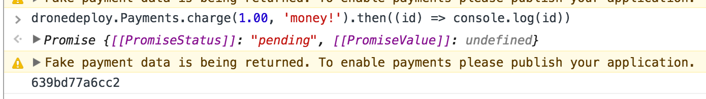

# Payments



* [Payments.charge](payments.md#payments.charge)
* [Payment FAQ](payments.md#payment-faq)

## Payments.charge

#### Overview

This call allows your app to ask the user for a one time payment. Users must have a paid account to run paid apps. Payments will processed at the end of the month. When you request a payment, the user will see a request.

.png>)

**Parameters**

```javascript
const amountInDollars = 0; // amount in USD
const paymentFor = ''; // payment description
dronedeployApi.Payments.charge(amountInDollars, paymentFor);
```

#### Example Call

```javascript
dronedeployApi.Payments.charge(4.00, 'Testing Payments')
  .then(
    function(success){ console.log('paymentId:', success) },
    function(error){ console.log(error) }
  )
```

**Note:** If your app is not published, the returned paymentId is fake and is not saved to our database. Additionally, having a paid account is not enforced while in development.

Here is a screenshot of what you would see if your app is not published. 

#### Example Response

**Success Response**

If the payment is successful you will receive the payment id.

```javascript
.then(function(paymentId){ console.log(paymentId) })
// 298348de72987ac
```

**Error Responses**

If the user clicks cancel on the payment request.

```javascript
.then(
  function(){},
  function(error){ console.log(error) },
)
// Error('User declined payment request.')
```

If the user does not have a paid account.

```javascript
.then(
  function(){},
  function(error){ console.log(error) },
)
// Error('User does not have a paid account.')
```

If the request fails (I.E. the user is offline).

```javascript
.then(
  function(){},
  function(error){ console.log(error) },
)
// Error('Error Submitting Payment')
```

[**Full Example**](../app-examples/example-payments.charge.md)

## Payment FAQ

### How to validate or cancel a payment?

1. From the account that authored the plugin, get your [API key here](../../api/authentication.md)
2. Send a `GET` request to this endpoint with your payment\_id, `/v1/plugin_payments/<payment_id>`
   1. Example Request
      1. ```shell
         curl "https://public-api.dronedeploy.com/v1/plugin_payments/5817d4b9361143b45cbb072b?api_key=f78b0a0d66274fd5a8684c49deb9d83d"
         Example Response
         ```
   2. Example Response
      1. ```json
         {
             "user_id": "57c5fc90dd32274105595f92", 
             "description": "Paid for something", 
             "date_creation": 1234567890100, 
             "date_paid": null, 
             "amount": 1000, 
             "plugin_id": "5817d4b6361143b45cbb072a", 
             "id": "5817d4b9361143b45cbb072b"
         }
         ```
3. To cancel a payment send a `PUT` request to `/v1/plugin_payments/<payment_id`_>_ with `{"status": "cancelled"`_}_ as the body.
   1. ```shell
      curl -X PUT -H "Content-Type: application/json" -d '{"status":"cancelled"}' "https://public-api.dronedeploy.com/v1/plugin_payments/589e239dc66a510001bd330b?api_key=65452af2874547428a90d008a8ed75dc"
      ```

[Read more about our REST API.](https://help.dronedeploy.com/hc/en-us/articles/1500004860561-Getting-started-API-key)
