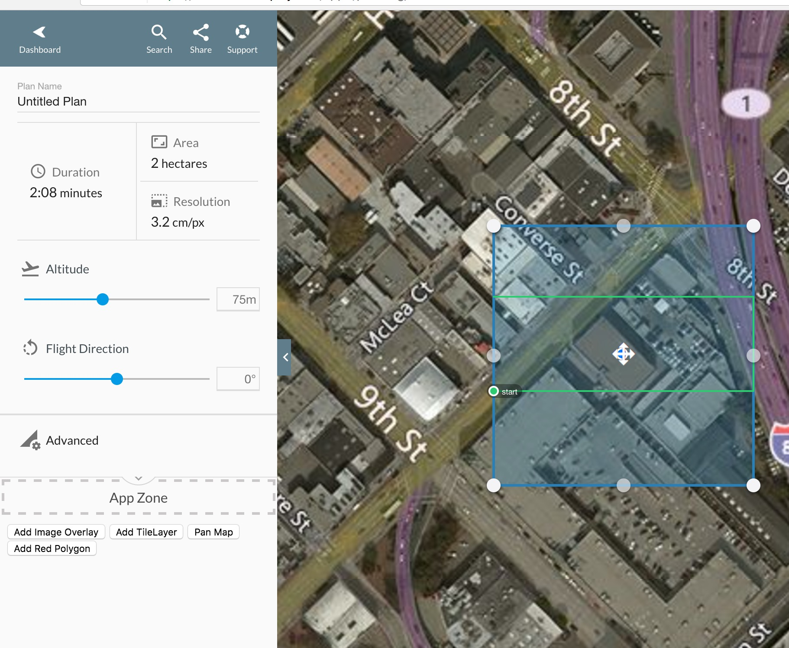

# Map API Example



```markup
<!DOCTYPE html>
<html lang="en">
<head>
  <meta charset="UTF-8">
  <title>Document</title>
</head>
<body>

<button id="tile-layer">Add TileLayer</button>

<script>
var $ = document.querySelector.bind(document);
new DroneDeploy({ version: 1 }).then(function(dronedeploy){
  function getPlanGeometry(){
    return dronedeploy.Plans.getCurrentlyViewed()
      .then(function(plan){
        return plan.geometry
      })
  }

  function putImageOverGeometry(geometry){
    dronedeploy.Map.addImageOverlay(
      "https://pbs.twimg.com/profile_images/740441209265606656/eYeOjy5i.jpg",
      geometry
    ).subscribe(function(overlay){})
  }

  $('#tile-layer').addEventListener('click', function(){
    dronedeploy.Map.addTileLayer('https://api.mapbox.com/styles/v1/mapbox/dark-v9/tiles/256/{z}/{x}/{y}?access_token=pk.eyJ1IjoiZGFuaWVscmFzbXVzb24yIiwiYSI6ImNpajM3anR2ODAwNGJ1eGtuNXFtbXhqMTMifQ.u3dqaFnALVDcqWyGu6Oq-w')
      .subscribe()
  });

});
</script>

</body>
</html>
```
